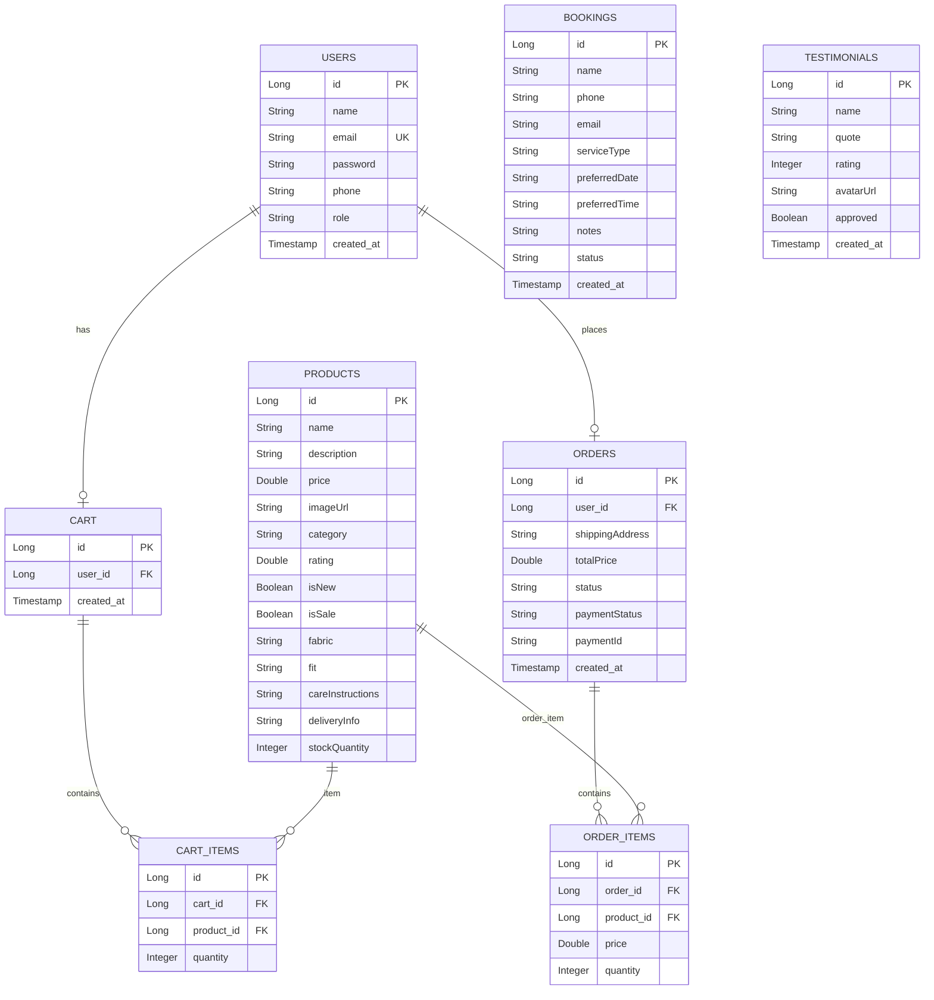

# Asha Boutique Store - Backend Architecture and Implementation Plan

This document outlines the design, database schema, API routing, folder structure, and step-by-step implementation plan for the Spring Boot backend.

---

## 1. Technologies & Prerequisites
* **Java Version:** 25 (utilizing modern Java features like records, pattern matching, and virtual threads)
* **Framework:** Spring Boot 3.4.x (Web, Security, Data JPA, Validation)
* **Database:** MySQL 8.x (Database: `ashaboutique_1`, User: `root`, Password: `root@1234`)
* **Security:** Spring Security with JWT (Stateless Authentication)
* **Build Tool:** Maven

---

## 2. Eclipse Project Folder Structure

The project will follow the standard Maven structure, which is fully compatible with Eclipse:

```text
Asha-Boutique-Store/backend/
├── pom.xml                                      # Maven dependencies and Java 25 configurations
└── src/
    ├── main/
    │   ├── java/
    │   │   └── com/
    │   │       └── ashaboutique/
    │   │           ├── AshaBoutiqueApplication.java # Spring Boot Entry Point
    │   │           ├── config/                  # Security, JWT, CORS, and DB Configurations
    │   │           │   ├── JwtAuthenticationFilter.java
    │   │           │   ├── JwtService.java
    │   │           │   ├── SecurityConfig.java
    │   │           │   └── WebConfig.java
    │   │           ├── controller/              # REST Controllers
    │   │           │   ├── AuthController.java
    │   │           │   ├── ProductController.java
    │   │           │   ├── CartController.java
    │   │           │   ├── OrderController.java
    │   │           │   ├── BookingController.java
    │   │           │   ├── TestimonialController.java
    │   │           │   └── TestController.java
    │   │           ├── model/                   # JPA Entity Classes
    │   │           │   ├── User.java
    │   │           │   ├── Role.java            # Enum: USER, ADMIN
    │   │           │   ├── Product.java
    │   │           │   ├── Cart.java
    │   │           │   ├── CartItem.java
    │   │           │   ├── Order.java
    │   │           │   ├── OrderItem.java
    │   │           │   ├── Booking.java
    │   │           │   └── Testimonial.java
    │   │           ├── repository/              # Spring Data JPA Repositories
    │   │           │   ├── UserRepository.java
    │   │           │   ├── ProductRepository.java
    │   │           │   ├── CartRepository.java
    │   │           │   ├── CartItemRepository.java
    │   │           │   ├── OrderRepository.java
    │   │           │   ├── BookingRepository.java
    │   │           │   └── TestimonialRepository.java
    │   │           ├── service/                 # Business Logic Interfaces and Implementations
    │   │           │   ├── AuthService.java
    │   │           │   ├── ProductService.java
    │   │           │   ├── CartService.java
    │   │           │   ├── OrderService.java
    │   │           │   ├── BookingService.java
    │   │           │   └── TestimonialService.java
    │   │           └── dto/                     # Request and Response Records (DTOs)
    │   │               ├── AuthRequest.java
    │   │               ├── AuthResponse.java
    │   │               ├── RegisterRequest.java
    │   │               ├── UserDto.java
    │   │               ├── ProductResponse.java
    │   │               ├── CartResponse.java
    │   │               ├── BookingRequest.java
    │   │               └── OrderRequest.java
    │   └── resources/
    │       ├── application.properties           # Database connection, JPA and server settings
    │       ├── static/
    │       └── templates/
    └── test/
        └── java/
            └── com/
                └── ashaboutique/
                    └── AshaBoutiqueApplicationTests.java
```

---

## 3. Database Schema Design (MySQL)

The backend will auto-create or validate tables using Hibernate DDL Auto. The tables mapping to `ashaboutique_1` are:



---

## 4. API Endpoints Map

All endpoints are prefixed with `/api/v1` and handle JSON requests/responses.

### 4.1 Authentication & Profile
* `POST /auth/register` (Public) - Create user, returns JWT and user profile.
* `POST /auth/login` (Public) - Authenticate email/password, returns JWT and user profile.
* `GET /auth/me` (Authenticated) - Get current user profile details.
* `GET /test` (Authenticated) - Simple route to test JWT token validation.

### 4.2 Product Catalog
* `GET /products` (Public) - Get all products (supports optional parameters: `category`, `search`).
* `GET /products/{id}` (Public) - Get product detail by ID.
* `POST /admin/products` (Admin Only) - Create a new product.
* `PUT /admin/products/{id}` (Admin Only) - Update product details.
* `DELETE /admin/products/{id}` (Admin Only) - Remove a product from the store.

### 4.3 Shopping Cart
* `GET /cart` (Authenticated) - Retrieve the user's active cart.
* `POST /cart/items` (Authenticated) - Add/Update item quantity in cart.
* `PUT /cart/items/{itemId}?quantity={qty}` (Authenticated) - Modify cart item quantity.
* `DELETE /cart/items/{itemId}` (Authenticated) - Remove specific item from cart.
* `DELETE /cart` (Authenticated) - Clear the user's cart.

### 4.4 Bookings (Appointment)
* `GET /bookings` (Authenticated) - Get all bookings made by the active user.
* `POST /bookings` (Public/Authenticated) - Book a boutique appointment.
* `GET /admin/bookings` (Admin Only) - View all system bookings.
* `PUT /admin/bookings/{id}/status` (Admin Only) - Approve, reject, or complete bookings (`CONFIRMED`, `COMPLETED`, `CANCELLED`).

### 4.5 Testimonials (Reviews)
* `GET /testimonials` (Public) - Get all approved testimonials.
* `POST /testimonials` (Public/Authenticated) - Submit a testimonial (defaults to unapproved).
* `GET /admin/testimonials` (Admin Only) - Get all testimonials (approved and pending).
* `PUT /admin/testimonials/{id}/approve?approve={bool}` (Admin Only) - Approve or reject testimonial.
* `DELETE /admin/testimonials/{id}` (Admin Only) - Delete testimonial.

### 4.6 Orders & Checkout
* `GET /orders` (Authenticated) - View user's order history.
* `GET /orders/{id}` (Authenticated) - View specific order details.
* `POST /orders` (Authenticated) - Convert active cart items into a pending order.
* `GET /admin/orders` (Admin Only) - View all customer orders.
* `PUT /admin/orders/{id}/status` (Admin Only) - Update shipment/process status.
* `PUT /admin/orders/{id}/payment` (Admin Only) - Update payment status (`PAID`, `FAILED`, `REFUNDED`) and optional transaction IDs.

---

## 5. Step-by-Step Backend Generation Plan

We will proceed iteratively:

### **Step 1: Project Initialization & Build Configuration**
* Create the project base directory and configure `pom.xml` with dependencies (Spring Boot Starter Web, JPA, Security, MySQL Connector, Validation, JWT library like `jjwt`).
* Configure Java 25 compatibility compiler flags.
* Setup `application.properties` with database connection settings and JWT secrets.

### **Step 2: Database Schema & Core Entities**
* Create Entity models: `User`, `Product`, `Cart`, `CartItem`, `Order`, `OrderItem`, `Booking`, `Testimonial`.
* Establish relationships and JPA mapping annotations.
* Setup corresponding JpaRepositories.

### **Step 3: Security & JWT Infrastructure**
* Implement `JwtService` for token generation and parsing.
* Implement `JwtAuthenticationFilter` to intercept requests.
* Configure `SecurityConfig` to set up request authorizations (permit public paths, restrict admin routes, configure CORS).
* Implement custom UserDetailsService.

### **Step 4: User Authentication Services & Test Endpoint**
* Implement registration and login logic in `AuthService`.
* Add `AuthController` exposing `/auth/register`, `/auth/login`, `/auth/me`.
* Implement `/test` endpoint to verify authentication works correctly.

### **Step 5: Product Catalog Services**
* Implement `ProductService` with search and filtering logic.
* Implement public and admin controllers for `/products` and `/admin/products`.
* Populate mock products into the database if the database is empty (automatic database seed).

### **Step 6: Shopping Cart Services**
* Implement `CartService` (handling cart retrieval, item add/remove/quantity update).
* Expose endpoints under `/cart`.

### **Step 7: Appointment & Review Services**
* Create booking and testimonial models, service logic, and controllers.
* Include status update administration APIs.

### **Step 8: Orders & Checkout Services**
* Implement checkout process (creating orders from cart items, clearing cart).
* Add order tracking status and payment status administration.

### **Step 9: End-to-End Integration & CORS Validation**
* Launch Spring Boot application and test with Postman/cURL.
* Enable CORS to ensure frontend at `localhost:5173` communicates successfully with backend at `localhost:8080`.
